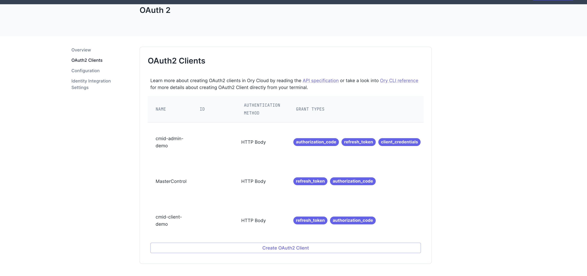
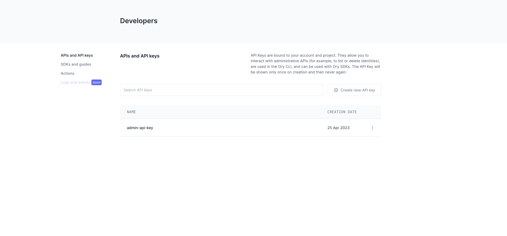
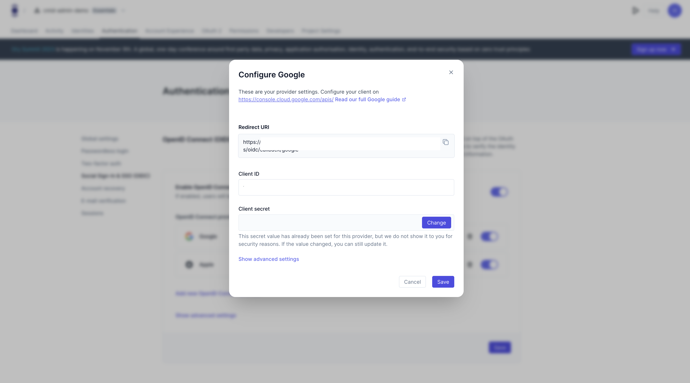
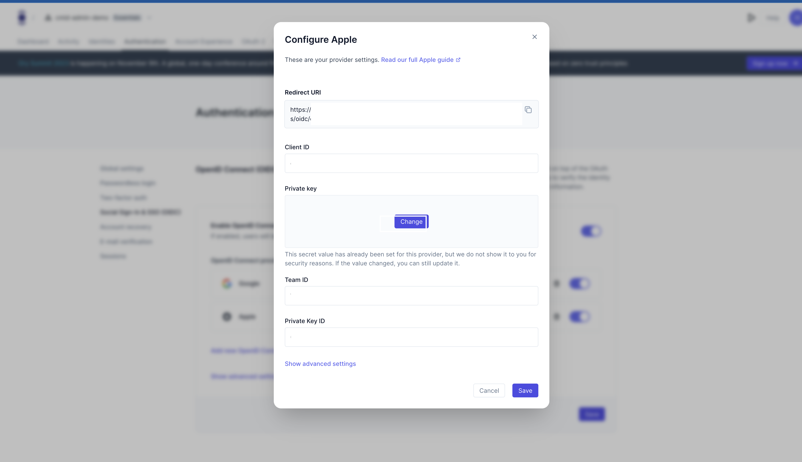

# Ory 資源


# Ory 架設

## kratos next service

```
  git clone https://github.com/ory/kratos-selfservice-ui-react-nextjs.git
```

## CMID-Admin-react

.env

```
ORY_SDK_URL=${ory sdk url}
ORY_CUSTOM_DOMAIN=${ory custom domain}
HYDRA_ADMIN_URL=${ory sdk url}
ORY_PAT=ory_pat_xxxxxxxxx
NEXT_PUBLIC_REDIRECT_URI=https://${customDomain}/api/auth/callback
```

* ORY_SDK_URL: Ory SDK Domain
* ORY_CUSTOM_DOMAIN: Ory custom domain
* ORY_PAT: API Key copied from the Ory Console, 'ory_pat' prefix include
* HYDRA_ADMIN_URL: Ory SDK Domain

### Ory Client



每一個 Client 可以建立一個 Client 做分辨

### Ory Api Key



建立一個 API Key 來使用 Ory Admin API

### Google Configure



建立 Google Sign in 的設定

[google SSO console setting](https://www.ory.sh/docs/kratos/social-signin/google)
### Apple Configure



建立 Apple Sign in 的設定

[apple SSO console setting](https://www.ory.sh/docs/kratos/social-signin/apple)

### Set data Mapping

[Ory data Mapping](https://www.ory.sh/docs/kratos/social-signin/data-mapping)

[Ory check session status](https://www.ory.sh/docs/identities/sign-in/check-session-token-cookie-api)
